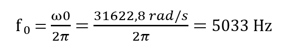
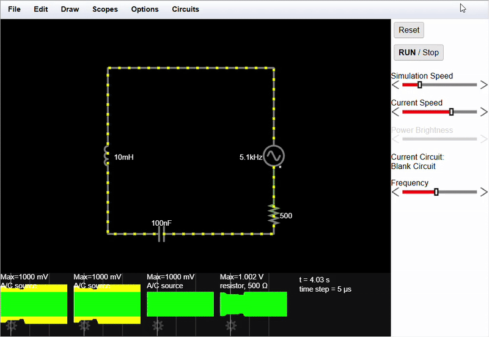
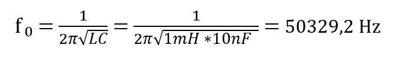
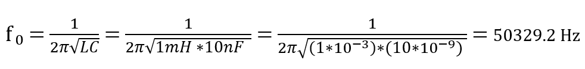
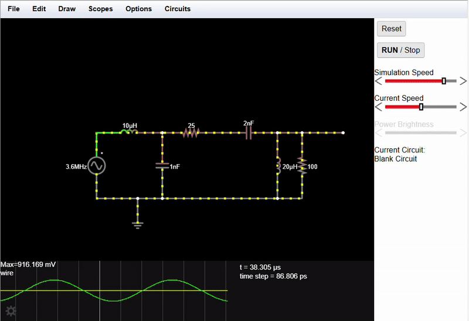
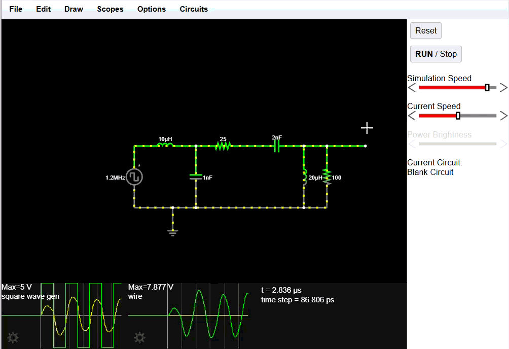

# Student Information

|                   |                             |
|-------------------|-----------------------------|
| Name              | Raul-Valentin Vasile        |
| Matrikelnummer    | 222756                      |
| Studiengang       |Software Engineering Bachelor|
| Kurs              | SV2                         |
| Betreuer          | Marc Nauendorf              |
| Akademisches Jahr | 2025/2026                   |

# Task 1  : Resonanzfrequenz des Reihenschwingkreises

    Bauteile : 
    -> AC-Spannungsquelle : U = 1 V
    -> Widerstand : R = 500 Ω
    -> Spule : L = 10 mH
    -> Kondensator : C = 100 nF

## 1) Berechnung theoretische Resonanzfrequenz f₀ :

### Omega-Berechnung : 

### Resonanzfrequenz-Berechnung : 

## 2) Simulation :

## 3) Gemessene Frequenz in Simulator :

    -> 5 kHz

## 4) Vergleich :

    Die theoretische Resonanzfrequenz (≈ 5033 Hz) stimmt sehr gut mit dem in der Simulation beobachteten Strommaximum bei etwa 5 kHz überein. Dies bestätigt die Aussage aus Folie 7, dass bei der Resonanzfrequenz der Gesamtwiderstand minimal und der Strom maximal ist.

# Task 2 : Güte und Dämpfung visualisieren

    Bauteile : 
    -> Spule : L = 20 mH
    -> Kondensator : C = 10 nF
    -> Widerstandd : R (variabel , Bereich : 10 Ω bis 1000 Ω)

## 1) , 2) & 3) Simulation : 

## 4 ) Erklären Sie den Zusammenhang , den Sie beobachten : 
      
### Frage : Was passiert mit der Höhe des Peaks ?
      Antwort :
      -> Mit größerem Widerstand wird der Peak niedriger

### Frage : Was passiert mit der Breite des Peaks ?
      Antwort :
      -> Mit größerem Widederstand wird der Peak breiter und weniger scharf

#### Frage : Was bedeutet das für die Güte Q und die Bandbreite der Schaltung ?
      Antwort :
      -> Ein größerer Widerstand bedeutet kleinere Güte Q und dadurch eine größere Bandbreite der Schaltung . 

# Task 3 : Bandpass vs Bandsperre 

    Bauteile :
    -> Spule : L = 1 mH
    -> Kondensator : C = 10 nF

## 1 , 3 & 4 ) GIF Dokumentation beider Schaltungen :
 
### Bandpass : 

  

### Bandsperre : 

  

## 2 ) Resonanzfrequenz berechnung :

## 5 ) Beantworten Sie die folgenden Fragen : 
     
### Aufgabe 1 : Bestätight Ihre Simulation die berechnete Resonanzfrequenz ? 
    Antwort : 
    -> Ja , in der Simulation zeigen beide Schaltungen ihre Verhalten , ebenfalls bei etwa 50 kHz.

### Aufgabe 2 : Beschreiben Sie präzise das gegensätzliche Verhalten der beiden Schaltungen bei dieser Frequenz . 
    Antwort:
    -> Beim Bandpass , ist die Ausgangsspannung bei der Resonanzfrequenz maximal 
    -> Beim Bandsperre , ist die Ausgangsspannung bei der Resonanzfrequenz minimal 

### Aufgabe 3 : Erklären Sie warum führt Aufbau 1 zu einem Spannungsmaximum , während Aufbau 2 zu einen Spannungsminimum 
    führt .
    Antwort :
    -> Es liegt am Impedanz , ein Parallelschwingkreis hat bei der Resonanzfrequenz eine sehr hohe Impedanz , dadurch fällt eine große Spannung am Ausgang ab , während ein Reihenschwingkreis bei der Resonanzfrequenz eine sehr kleine Impedanz hat , deswegen wird der Ausgang nahezu kurzgeschlossen 

# Task 4 : Der 3-Bit D/A-Wandler 

    Gegebene Daten : 
    -> 1 DC-Spannungsquelle : 10 V
    -> 3 Umschalter (SPDT) : Representieren die Bits 0 (LSB), 1 und 2 (MSB)
    -> Widerstände : R = 1 kΩ und R2 = 2 kΩ   

## 1  & 4  ) GIF Dokumentaion der R-2R-Netzwerks :

  

## 2  & 3  ) Tabelle der gemessenen Ausgangsspannungen für jede Bit-Kombination :

  |  Bit 2(MSB)     |     Bit 1      |    Bit 0(LSB)    |     Dezimalzahl   |      Uaus(V)     |             
  |-----------------|----------------|------------------|-------------------|------------------|
  |       0         |       0        |        0         |        0          |        0         |  
  |-----------------|----------------|------------------|-------------------|------------------|
  |       0         |       0        |        1         |        1          |      3.333       |
  |-----------------|----------------|------------------|-------------------|------------------|
  |       0         |       1        |        0         |        2          |        4         |
  |-----------------|----------------|------------------|-------------------|------------------|
  |       0         |       1        |        1         |        3          |      4.762       |
  |-----------------|----------------|------------------|-------------------|------------------|
  |       1         |       0        |        0         |        4          |        5         |  
  |-----------------|----------------|------------------|-------------------|------------------|
  |       1         |       0        |        1         |        5          |        6         |
  |-----------------|----------------|------------------|-------------------|------------------|
  |       1         |       1        |        0         |        6          |      6.250       |
  |-----------------|----------------|------------------|-------------------|------------------|
  |       1         |       1        |        1         |        7          |      6.563       |
  |_________________|________________|__________________|___________________|__________________|

## 5 ) Analyzieren sie Ihre Messwerte , was stellen Sie fest ? :

    -> Die Ausgangsspannung steigt mit jeder weiteren Schalterstellung stufenweise ein 

## 6 ) Berechnen Sie die Spannungsdifferenz zwischen den einzelnen Dezimalwerten . Ist diese Schrittgröße Konstant ? :

  |      Schritt      |    Differenz    |
  |-------------------|-----------------| 
  |       0 - 1       |      3.333      |
  |-------------------|-----------------| 
  |       1 - 2       |      0.670      |
  |-------------------|-----------------|
  |       2 - 3       |      0.762      |
  |-------------------|-----------------|
  |       3 - 4       |      0.238      |
  |-------------------|-----------------|
  |       4 - 5       |        1        |
  |-------------------|-----------------|
  |       5 - 6       |      0.256      |
  |-------------------|-----------------|
  |       6 - 7       |      0.313      |
  |___________________|_________________|

    -> Nein , die Schrittgröße ist nicht Konstant . Es sind sichtbare Ungleichmäßigkeiten vorhanden . Die Abstände 
    zwischen den Messwerten sind von Schritt zu Schritt unterschiedlich . 

## 7 ) Erklären Sie , warum die Schaltung das tut , was auf Folie 30 gezeigt wird : 

    -> Durch die begrenzte Anzahl an Bitkombinationen kann die Ausgangsspannung nur diskrete Werte annehmen . Beim Durchschalten der Binärkombinationen ändert sich die Ausgangsspannung daher nicht kontinuierlich , sondern Stufenweise . Dadurch entsteht eine Treppenfunktion , wie sie auch auf den Folien bei der Quantisierung eines analogen Signals gezeigt wird  

# Task 5 : Filterung von Obertönen (Rechteck-zu-Sinus-Wandler)

    Bauteile : 
    -> L = 1 mH
    -> C = 10 nF

## 1 ) Berechnen Sie die theoretische Resonanzfrequenz f₀ für den LC-Bandpass :

  

## 2 , 3 & 4 ) GIF Simulation der Rechtek-zu-Sinus-Wandler : 

  

## 5 ) Erklärung :

### Aufgabe 1 : Beschreiben Sie den Unterschied zwischen den Eingans- und der Ausgangswellenform :
    Antwort :
      -> Das Eingangssignal ist eine Rechteckspannung mit steilen Flanken und abrupten Spannungsänderungen . Das Ausgangssignal des LC-Bandpasses ist hingegen nahezu sinusförmig und weist keine steilen Flanken mehr auf . Außerdem ist die Amplitude des Ausgangssignals gegenüber dem Eingangssignal reduziert .

### Aufgabe 2 : Erklären Sie mit Verweis auf die Fourier-Analyze , warum das Ausgangssignal diese Form hat . Welche Frequenzkomponenten der Rechteckwelle lässt der Filter passieren und welche blockiert es ? 
    Antwort : 
      -> Die eingespeiste Rechtecksspannung besteht laut Fourier-Analyze aus der Grundfrequenz und ungeraden Oberwellen .Der LC-Bandpass ist auf  die Grundfrequenz abgestimmt und lässt diese passieren , während die höheren Oberwellen blockiert werden . Dadurch bleibt am Ausgang überwiegend nur die Grundschwingung übrig , sodass das Ausgangssignal nahezu sinusförmig ist . 
 

# Task 6 : Fourier-Analyze eines komplexen Filters 

    Bauteile : 
    -> Quelle : A/C-Quelle
    -> Spule L1 : 10 µH
    -> Kondensator C1 : 1 nF
    -> Widerstand R1 : 	25 Ω
    -> Spule L2 : 20 µH
    -> Kondensator C2 : 2 nF
    -> Widerstand R2 : 100 Ω

## Schritt 1 : 

### Führen Sie eine AC-Analyze am Ausgang (V) durch : 

### Finden Sie die Frequenz , bei der die Schaltung ihre stärkste Resonanz zeigt : 

    Antwort : 
    -> Die Schaltung zeigt ihre stärkste Resonanz bei 3.54 MHz . 

## Schritt 2 : 

### Grundfrequenz der Rechteckquelle : 3.56 MHz

## Beantworten Sie die folgenden Fragen basierend auf Ihren Beobachtung aus Schritt 2 : 

### Zeitbereich : Vergleichen Sie das Eingangs- und Ausgangssignal . Welche Form hat das Ausgangssignal ? Welche Frequenz hat es ? 

    Antwort :
    -> Eingangssignal : Rechtecksförmige wellen 
    -> Ausgangsspannung : Sinusförmige wellen 
    -> Frequenz : 1.18 MHz 

### Frequenzbereich (Eingang) : Beschreiben Sie das Spektrum der Rechteckwelle , das Sie sehen . Welche Harmonischen sind vorhanden .

    Antwort : 
    -> Das Spektrum der Rechteckschwingung besteht aus der Grundschwingung sowie ungeraden Harmonischen (ca. 1.18 MHz , 
    3.54 MHz , 5.9 MHz , 8.26 MHz) 

### Frequenzbereich (Ausgang) : Beschreiben Sie das Spektrum am Ausgang . Was ist mit der Grundschwingung (1.18 MHz) passiert ? Was ist mit der 3. Harmonischen (3.56 MHz) passiert ? 

    Antwort :
    -> Im Frequenzbereich ist die Grundschwingung bei 1.18  MHz am Ausgang stark abgeschwächt. Die 3. Harmonische bei 3.54 MHz liegt nahe der Resonanzfrequenz der Schaltung und wird daher deutlich verstärkt 

### Erklärung : Fassen Sie zusammen , was der Filter mit dem Rechteksignal gemacht hat und warum das Ausgangssignal so aussieht , wie es aussieht . 

    Antwort : 
    -> Der Rechtecksignal setzt sich aus mehreren Sinusschwingungen mit unterschiedlichen Frequenzen zusammen . Der Filter lässt vor allem die Frequenzen durch , die in der Nähe seiner Resonanzfrequenz liegen . Dadurch bleibt am Ausgang hauptsächlich eine Sinusschwingung übrig , weshalb das Ausgangssignal nahezu sinusförmig aussieht . 

